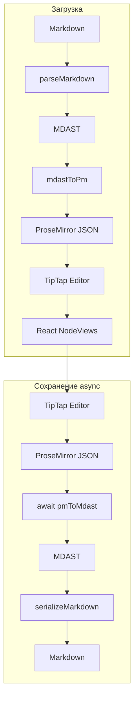

# Markdown Editor — документация

WYSIWYG-редактор Markdown с поддержкой директив (remark-directive). Контент хранится как ProseMirror-документ, при сохранении сериализуется в Markdown без потерь.

## Введение

Редактор построен по принципу **Markdown-first**: Markdown — канонический формат данных. Документ загружается как Markdown, редактируется визуально через TipTap, при сохранении снова выводится в Markdown.

Поддерживаются кастомные директивы:

- **Alert** — блок-уведомление (info, warning, success, error)
- **Lead** — блок-лид (выделенный параграф)
- **Badge** — inline-метка (`:badge[текст]`)
- **Tooltip** — inline-подсказка при наведении
- **Columns** — блок с двумя колонками
- **Product** — leaf-виджет продукта (`::product{id="..."}`)

## Архитектура



### Слои

| Слой | Описание |
|------|----------|
| **Markdown** | Строка с синтаксисом remark-directive |
| **MDAST** | Markdown Abstract Syntax Tree (unified/remark) |
| **ProseMirror** | JSON-документ (TipTap/ProseMirror) |
| **TipTap** | Редактор, управление состоянием |
| **React NodeViews** | UI для alert, badge, tooltip, product (leaf через DirectiveNodeView) |

## Плагины

### Alert

Блок-контейнер для уведомлений.

- **Тип:** block
- **Атрибуты:** `type` (info, warning, success, error)
- **Markdown:** `:::alert{type="warning"} ... :::`
- **Вставка:** slash-меню → Alert

### Lead

Блок-лид (выделенный параграф).

- **Тип:** block
- **Markdown:** `:::lead ... :::`
- **Вставка:** slash-меню → Lead

### Badge

Inline-метка с редактируемым текстом.

- **Тип:** text (inline)
- **Markdown:** `:badge[текст]`
- **Вставка:** slash-меню → Badge

### Tooltip

Inline-подсказка при наведении.

- **Тип:** inline
- **Атрибуты:** `content` — текст подсказки
- **Контент:** видимый текст в редакторе
- **Markdown:** `:tooltip[видимый]{content="подсказка"}`
- **Вставка:** slash-меню → два prompt (видимый текст, текст подсказки)

### Product

Leaf-виджет продукта (карточка с данными по id).

- **Тип:** leaf (block, atom)
- **Атрибуты:** `id`, `buttonText`
- **Markdown:** `::product{id="55201" buttonText="Купить"}`
- **Вставка:** slash-меню → Product, prompt для id
- **Команды:** «Сменить текст кнопки» в меню блока

Использует универсальный directiveLeaf node (см. «Унифицированные директивы»).

### Columns

Блок с двумя колонками.

- **Тип:** block
- **Контент:** две column-ноды с block-контентом
- **Markdown:** `::::columns` + `:::column` ... `:::`
- **Вставка:** slash-меню → Columns

### Унифицированные директивы (registerDirective)

Все плагины регистрируются через единый `registerDirective()` с указанием типа:

```ts
// leaf (::product{id})
registerDirective({
  name: "product",
  type: "leaf",
  component: ProductWidget,
  defaultProps: { id: "", buttonText: "Купить" },
  slashMenu: { title: "Product", keywords: ["product"] },
  onSlashSelect: (editor) => { ... },
  customCommands: [...],
});

// container (:::alert{type}...:::)
registerDirective({
  name: "alert",
  type: "container",
  component: AlertWidget,
  defaultProps: { type: "info" },
  slashMenu: { title: "Alert", keywords: ["alert"] },
  onSlashSelect: (editor) => { ... },
});

// text (:badge[текст])
registerDirective({
  name: "badge",
  type: "text",
  component: BadgeWidget,
  slashMenu: { title: "Badge", keywords: ["badge"] },
  onSlashSelect: (editor) => { ... },
});
```

Три общих TipTap-ноды: `directiveLeaf`, `directiveContainer`, `directiveText`. Extension писать не нужно.

### Обёртка block-плагинов (BlockPluginWrapper)

Block-плагины (alert, lead, columns, column) обёрнуты в `BlockPluginWrapper`. При наведении на блок слева появляется кнопка меню (три точки). По клику открывается dropdown с командами:

- **Удалить** — удаляет блок
- **Переместить выше** — меняет порядок с предыдущим sibling
- **Переместить ниже** — меняет порядок со следующим sibling
- **Кастомные команды** — опционально, передаются через `withBlockPluginWrapper(Component, { customCommands })`

Использование: `withBlockPluginWrapper(MyWidget, { customCommands: [{ id, label, onClick }] })`. Inline-плагины (badge, tooltip) пока без обёртки.

## Slash-меню

При вводе `/` открывается меню с пунктами: Columns, Alert, Lead, Badge, Product, Tooltip.

- **Поиск:** фильтрация по `title` и `keywords`
- **Навигация:** ArrowUp/ArrowDown, Enter — выбор
- **Клик:** выбор пункта

Пункты задаются в `registerDirective()` (slashMenu, onSlashSelect) или в `createContainerPlugin` для columns. Добавление нового пункта — через реестр (см. «Реестр плагинов»).

## Использование

```tsx
import { Editor } from "@/components/Editor/Editor";
import { parseMarkdown } from "@/editor/markdown/parseMarkdown";
import { mdastToPm } from "@/editor/markdown/mdastToPm";

const markdown = '# Title\n\n:::alert{type="info"}\nContent\n:::';
const tree = parseMarkdown(markdown);
const initialContent = mdastToPm(tree);

<Editor
  content={initialContent}
  onSave={(md) => console.log(md)}
/>
```

**Props:**

- `content` — начальный контент в формате `{ type: "doc", content: [...] }`
- `onSave` — callback при нажатии «Сохранить», получает Markdown-строку

При сохранении конвертация PM → MDAST выполняется асинхронно; кнопка блокируется до завершения.

## Синтаксис директив (remark-directive)

| Тип | Синтаксис | Пример |
|-----|-----------|--------|
| Container | `:::name{attrs} ... :::` | `:::alert{type="warning"} ... :::` |
| Leaf | `::name{attrs}` | `::product{id="55201"}` |
| Text | `:name[текст]{attrs}` | `:tooltip[hover me]{content="Hi"}` |

Количество двоеточий: 1 — text, 2 — leaf, 3+ — container. Leaf-директивы используют единый формат `::name{props}`.

## Реестр плагинов

### Унифицированные плагины (registerDirective)

Все плагины (leaf, container, text) регистрируются через `registerDirective()`:

1. Создать React-компонент (читает `node.attrs.props`)
2. Создать `myplugin.plugin.ts` с вызовом `registerDirective({ name, type, component, ... })`
3. Добавить импорт `import "./myplugin/myplugin.plugin"` в `plugins/registry.ts`

Extension писать не нужно — используются общие `directiveLeaf`, `directiveContainer`, `directiveText`.

### Исключение: columns

Columns имеет вложенную структуру (columns > column > block+). Регистрируется через `createContainerPlugin` в `columns/config.ts`.

### Асинхронный экспорт при сохранении

`pmToMdast` и конвертеры плагинов (`pmToMdast`, `pmToPhrasing`) — асинхронные. Плагины возвращают `Promise<RootContent | null>` и `Promise<PhrasingContent[]>`. Это позволяет в будущем делать запросы, загружать данные и т.д. перед сериализацией в Markdown.

- **PmHelpers**: `convertBlockToMdast` и `convertInlineToPhrasing` возвращают `Promise`
- **PluginConfig**: `pmToMdast` и `pmToPhrasing` возвращают `Promise`
- **Editor**: кнопка «Сохранить» блокируется во время сохранения, отображается «Сохранение…»

Кастомный плагин с async-логикой:

```ts
pmToMdast: async (node, helpers) => {
  const data = await fetchData(node.attrs.id);
  const content = await Promise.all(
    (node.content ?? []).map(helpers.convertBlockToMdast)
  );
  return { type: "containerDirective", name: "myPlugin", attributes: data, children: content.filter(Boolean) };
}
```

## Структура файлов

```
src/
  components/Editor/
    Editor.tsx
    EditorToolbar.tsx
  editor/
    core/extensions.ts
    directives/
      registry.ts           # registerDirective, getLeafDirective, getContainerDirective, getTextDirective
      directive.extension.ts       # directiveLeaf
      directive-container.extension.ts
      directive-text.extension.ts
      DirectiveNodeView.tsx
      DirectiveContainerNodeView.tsx
      DirectiveTextNodeView.tsx
      types.ts
      index.ts
    markdown/
      parseMarkdown.ts
      serializeMarkdown.ts
      pmToMdast.ts
      mdastToPm.ts
    plugins/
      plugin-types.ts
      plugin-factories.ts    # createContainerPlugin (только columns), createSlashInsert
      block-plugin-wrapper/
      registry.ts
      alert/                # alert.plugin.ts, alert.widget.tsx
      lead/                 # lead.plugin.ts, lead.widget.tsx
      tooltip/              # tooltip.plugin.ts, tooltip.widget.tsx
      badge/                # badge.plugin.ts, badge.widget.tsx
      product/              # product.plugin.ts, product.widget.tsx
      columns/              # config.ts, column.extension, columns.extension (исключение)
    slash-menu/
```
