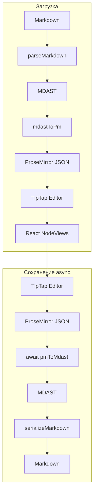

# Markdown Editor — документация

WYSIWYG-редактор Markdown с поддержкой директив (remark-directive). Контент хранится как ProseMirror-документ, при сохранении сериализуется в Markdown без потерь.

## Введение

Редактор построен по принципу **Markdown-first**: Markdown — канонический формат данных. Документ загружается как Markdown, редактируется визуально через TipTap, при сохранении снова выводится в Markdown.

Поддерживаются кастомные директивы:

- **Alert** — блок-уведомление (info, warning, success, error)
- **Badge** — inline-метка
- **Tooltip** — inline-подсказка при наведении
- **Columns** — блок с двумя колонками

## Архитектура



### Слои

| Слой | Описание |
|------|----------|
| **Markdown** | Строка с синтаксисом remark-directive |
| **MDAST** | Markdown Abstract Syntax Tree (unified/remark) |
| **ProseMirror** | JSON-документ (TipTap/ProseMirror) |
| **TipTap** | Редактор, управление состоянием |
| **React NodeViews** | UI для alert, badge, tooltip |

## Плагины

### Alert

Блок-контейнер для уведомлений.

- **Тип:** block
- **Атрибуты:** `type` (info, warning, success, error)
- **Markdown:** `:::alert{type="warning"} ... :::`
- **Вставка:** slash-меню → Alert

### Badge

Inline-метка, ширина по контенту.

- **Тип:** inline
- **Контент:** редактируемый текст
- **Markdown:** `:badge[текст]` (text directive, в тексте) или `::badge[текст]` (leaf directive, **на отдельной строке**)
- **Вставка:** slash-меню → Badge, курсор внутри

Leaf-директива `::` работает только на своей строке; в середине параграфа она не парсится.

### Tooltip

Inline-подсказка при наведении.

- **Тип:** inline
- **Атрибуты:** `content` — текст подсказки
- **Контент:** видимый текст в редакторе
- **Markdown:** `:tooltip[видимый]{content="подсказка"}`
- **Вставка:** slash-меню → два prompt (видимый текст, текст подсказки)

### Columns

Блок с двумя колонками.

- **Тип:** block
- **Контент:** две column-ноды с block-контентом
- **Markdown:** `::::columns` + `:::column` ... `:::`
- **Вставка:** slash-меню → Columns

## Slash-меню

При вводе `/` открывается меню с пунктами: Columns, Alert, Badge, Tooltip.

- **Поиск:** фильтрация по `title` и `keywords`
- **Навигация:** ArrowUp/ArrowDown, Enter — выбор
- **Клик:** выбор пункта

Пункты задаются в конфиге плагина (`slashMenu`). Добавление нового пункта — через реестр плагинов (см. раздел «Реестр плагинов»).

## Использование

```tsx
import { Editor } from "@/components/Editor/Editor";
import { parseMarkdown } from "@/editor/markdown/parseMarkdown";
import { mdastToPm } from "@/editor/markdown/mdastToPm";

const markdown = '# Title\n\n:::alert{type="info"}\nContent\n:::';
const tree = parseMarkdown(markdown);
const initialContent = mdastToPm(tree);

<Editor
  content={initialContent}
  onSave={(md) => console.log(md)}
/>
```

**Props:**

- `content` — начальный контент в формате `{ type: "doc", content: [...] }`
- `onSave` — callback при нажатии «Сохранить», получает Markdown-строку

При сохранении конвертация PM → MDAST выполняется асинхронно; кнопка блокируется до завершения.

## Синтаксис директив (remark-directive)

| Тип | Синтаксис | Пример |
|-----|-----------|--------|
| Container | `:::name{attrs} ... :::` | `:::alert{type="warning"} ... :::` |
| Leaf | `::name{attrs}` или `::name[label]` | `::badge[New]` |
| Text | `:name[текст]{attrs}` | `:tooltip[hover me]{content="Hi"}` |

Количество двоеточий: 1 — text, 2 — leaf, 3+ — container.

## Реестр плагинов

Плагины регистрируются через конфиг. Добавление нового плагина:

1. Создать папку `plugins/myplugin/`
2. Добавить `myplugin.extension.ts`, `myplugin.nodeview.tsx`
3. Добавить `myplugin/config.ts` — использовать фабрики `createContainerPlugin`, `createTextPlugin`, `createSlashInsert` из `plugin-factories.ts` или задать `PluginConfig` вручную
4. Добавить импорт и регистрацию в `plugins/registry.ts`

Одна точка подключения — `registry.ts`. Расширения, mdastToPm, pmToMdast и slash-меню читают из реестра.

### Асинхронный экспорт при сохранении

`pmToMdast` и конвертеры плагинов (`pmToMdast`, `pmToPhrasing`) — асинхронные. Плагины возвращают `Promise<RootContent | null>` и `Promise<PhrasingContent[]>`. Это позволяет в будущем делать запросы, загружать данные и т.д. перед сериализацией в Markdown.

- **PmHelpers**: `convertBlockToMdast` и `convertInlineToPhrasing` возвращают `Promise`
- **PluginConfig**: `pmToMdast` и `pmToPhrasing` возвращают `Promise`
- **Editor**: кнопка «Сохранить» блокируется во время сохранения, отображается «Сохранение…»

Кастомный плагин с async-логикой:

```ts
pmToMdast: async (node, helpers) => {
  const data = await fetchData(node.attrs.id);
  const content = await Promise.all(
    (node.content ?? []).map(helpers.convertBlockToMdast)
  );
  return { type: "containerDirective", name: "myPlugin", attributes: data, children: content.filter(Boolean) };
}
```

## Структура файлов

```
src/
  components/Editor/
    Editor.tsx          # Компонент редактора
    EditorToolbar.tsx   # Тулбар форматирования
  editor/
    core/
      extensions.ts    # Регистрация расширений (из реестра)
    markdown/
      parseMarkdown.ts       # Markdown → MDAST
      serializeMarkdown.ts   # MDAST → Markdown
      pmToMdast.ts           # ProseMirror → MDAST (async)
      mdastToPm.ts           # MDAST → ProseMirror
    plugins/
      plugin-types.ts      # Интерфейсы PMNode, PluginConfig
      plugin-factories.ts  # createContainerPlugin, createTextPlugin, createSlashInsert
      registry.ts         # Реестр плагинов
      alert/           # config + extension + NodeView
      badge/
      tooltip/
      columns/
    slash-menu/
      slash-command.extension.ts  # Extension
      slash-menu-items.ts         # Пункты меню (из реестра)
      SlashMenuList.tsx          # UI списка
```
